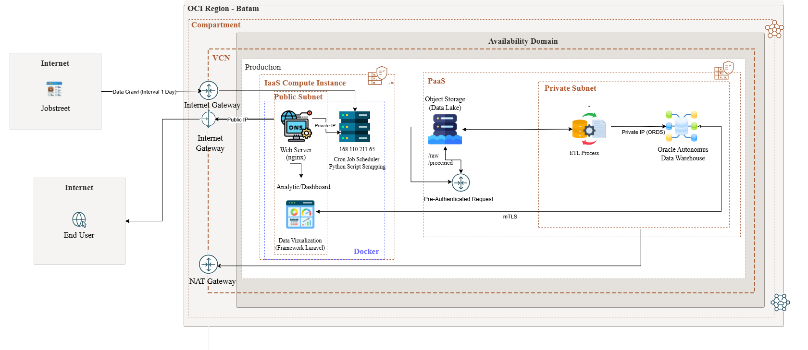
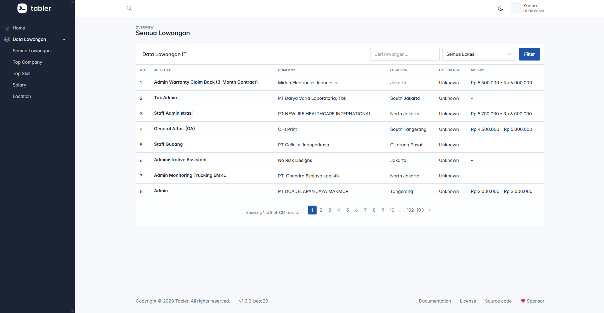
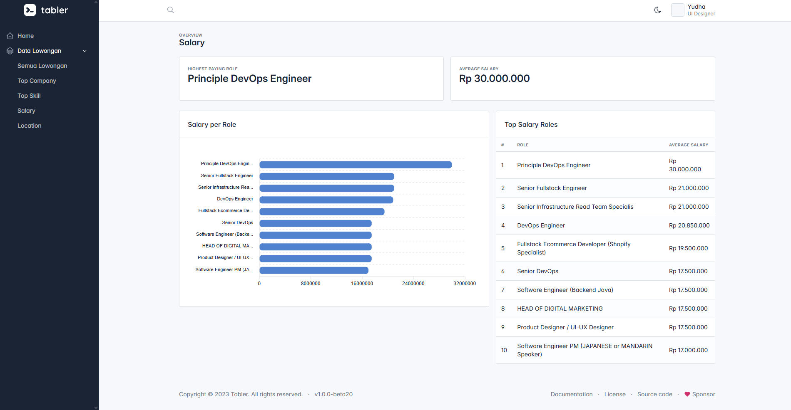
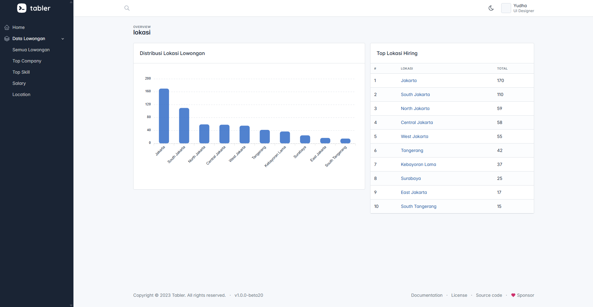

# 📊 Job Analytics: National IT Job Market Trend Analysis System Using Big Data & Cloud Computing

  
  

## 🧠 Why We Built This

The rapid growth of the digital economy has significantly increased the demand for Information Technology (IT) professionals across various industries. Every day, thousands of job vacancies are published on recruitment platforms, creating a massive volume of data that contains valuable insights regarding industry needs, required skills, salary trends, and employment opportunities.

However, this information is often scattered across multiple platforms and remains difficult to analyze manually. Educational institutions, students, and job seekers frequently struggle to identify which skills and positions are currently in demand.

This project was developed to answer a simple but important question:

> *How can we transform large-scale job vacancy data into meaningful insights that help educational institutions and job seekers understand current industry demands?*

---

## 🚀 What We Built

We developed a web-based analytics platform that automatically collects, processes, and analyzes IT job vacancy data from JobStreet using Big Data and Cloud Computing technologies.

The system provides:

* 📈 Real-time job market analytics
* 💼 Top IT positions currently in demand
* 🏙️ Geographic distribution of IT vacancies
* 💰 Salary range analysis
* 📄 Employment contract classification
* 🔍 Skill and job trend identification

Rather than simply displaying raw job postings, the platform transforms data into actionable insights through an interactive analytics dashboard.

---

## 🎯 Project Context

* **Project Type:** Project Based Learning (PBL)
* **Field:** Big Data & Cloud Computing
* **Institution:** State Polytechnic of Malang
* **Academic Year:** 2026

### 👥 Team Members

| Name | Student ID | Role | Contribution |
|------|------------|------|--------------|
| Achmad Doli Harahap | 254107027010 | Data Analyst | Performed SQL-based data analysis, generated job market insights, defined analytical metrics, and prepared statistics for the dashboard. |
| Bagas Yudha Aditya | 254107027007 | Data Engineer | Developed web scraping and ETL pipelines, automated data collection, cleaned datasets, and managed data integration processes. |
| Daril Oktavian | 254107027002 | Cloud & Database Administrator | Configured Oracle Cloud infrastructure, managed Autonomous Database, designed database schemas, and maintained network connectivity. |
| Muhammad Farid Mauludin | 254107027015 | Fullstack Developer / UI Specialist | Developed the Laravel dashboard, integrated database services, and created interactive data visualizations using Chart.js. |

---

## 🌍 System Scale

* Automated daily data collection from JobStreet
* Large-scale IT job vacancy dataset
* Cloud-based infrastructure deployment
* Automated ETL pipeline
* Interactive web dashboard
* Historical trend monitoring

---

## ⚙️ Our Approach

Instead of manually collecting and analyzing job market information, we designed an automated analytics pipeline based on three core principles:

### 1. Automated Data Collection

Job market data changes rapidly.

➡️ The system automatically crawls JobStreet vacancy data daily using Python-based scraping services.

### 2. Data Transformation & Standardization

Raw vacancy descriptions often contain inconsistent formats.

➡️ ETL processes clean, normalize, and classify job positions, skills, salary information, and employment types.

### 3. Insight-Driven Visualization

Raw datasets are difficult to interpret.

➡️ Interactive dashboards transform complex datasets into meaningful charts and business insights.

---

## 🏗️ System Architecture

  

  <em>
The system architecture consists of automated data collection services, ETL processing pipelines, cloud-based storage, analytical databases, and a web dashboard that delivers real-time insights regarding IT job market trends across Indonesia.
  </em>

---

# 🚀 Key Features

<table>
<tr>
<td align="center" width="50%">

### 📊 Job Market Dashboard

Provides a comprehensive overview of the IT job market, including total job postings, company participation, salary distribution, and key recruitment metrics.

</td>

<td align="center" width="50%">

### 📄 Job Vacancy Analysis

Analyzes available IT job opportunities and highlights the most in-demand job positions across the market.

</td>
</tr>

<tr>
<td align="center">

### 🏢 Top Company Analysis

Identifies companies with the highest number of job postings, providing insights into the most active recruiters in the industry.

</td>

<td align="center">

### 🛠️ Top Skills Analysis

Examines the most frequently requested technical and professional skills to help understand current market demands.

</td>
</tr>

<tr>
<td align="center">

### 💰 Salary Analysis

Provides salary range insights for various IT roles, supporting career planning and compensation benchmarking.

</td>

<td align="center">

### 📍 Location Analysis

Visualizes the geographical distribution of job opportunities, highlighting regions with the highest hiring activity.

</td>
</tr>
</table>
---

## 🧠 Design Reasoning

### The Problem

The IT job market evolves rapidly, making it difficult for educational institutions and job seekers to stay aligned with industry demands.

Without proper analytics:

* Skills become outdated
* Curriculum relevance decreases
* Job seekers lack market awareness

### The Solution

Our system automatically transforms large volumes of job vacancy data into meaningful information through:

1. Automated Web Scraping
2. ETL Processing
3. Cloud-Based Data Storage
4. Interactive Analytics Dashboard

This enables users to make data-driven decisions based on actual industry demands.

---

## 📊 Dataset

### Source

* JobStreet Indonesia

### Data Collected

* Job Title
* Company Name
* Location
* Required Skills
* Experience Level
* Salary Information
* Employment Type
* Posting Date

### Format

* JSON
* CSV

---

## 🔄 Data Analytics Pipeline

### 1. Data Collection

JobStreet → Python Scraper

### 2. Data Cleaning

Cleaning duplicate records and handling missing values.

### 3. Data Transformation

* Skill Extraction
* Salary Normalization
* Job Classification
* Contract Classification

### 4. Data Storage

* Oracle Object Storage (Data Lake)
* Oracle Autonomous Data Warehouse

### 5. Analytics

* Top Positions Analysis
* Salary Analysis
* Regional Analysis
* Trend Analysis

### 6. Dashboard Visualization

Laravel-based analytics dashboard.

---

## 📈 Dashboard Analytics

### Headline Metrics

* Total Job Vacancies
* Top Job Position
* Top Hiring City
* Last Updated Status

### Visual Analytics

* Job Trends Over Time
* Top Positions Ranking
* Salary Distribution
* Employment Type Distribution
* Regional Distribution Analysis

---

## 🌐 Live System Access

### Dashboard

https://projectakhir.my.id/

### Demo Account

**Email** :
dariloktavian@gmail.com

**Password** :
12345678

---

## 🛠️ Tech Stack

| Category         | Technologies                     |
| ---------------- | -------------------------------- |
| Data Collection  | Python, Selenium                 |
| Data Processing  | Python, Pandas                   |
| Backend          | PHP, Laravel                     |
| Database         | MySQL                            |
| Cloud Platform   | Oracle Cloud Infrastructure      |
| Data Lake        | Oracle Object Storage            |
| Data Warehouse   | Oracle Autonomous Data Warehouse |
| Visualization    | Chart.js                         |
| Containerization | Docker                           |
| Version Control  | GitHub                           |
| Deployment       | CI/CD Pipeline                   |

---

## 📊 Key Findings

The analysis revealed several important insights:

* Software Engineering roles remain highly demanded.
* Demand for Data-related positions continues to grow.
* Jakarta remains the dominant hiring location.
* Salary levels vary significantly across job categories.
* Contract and remote opportunities are increasing in several sectors.

🚨 **Insight**

Technology trends continuously evolve, making data-driven workforce analysis essential for educational institutions, students, and job seekers to remain aligned with industry requirements.

---

## 📚 Academic Context

This project was developed as part of the Project Based Learning (PBL) program at State Polytechnic of Malang.

### Project Title

**Job Analytics: National IT Job Market Trend Analysis System Using Big Data & Cloud Computing**

### Focus Areas

* Big Data Analytics
* Cloud Computing
* Data Engineering
* Web Analytics Dashboard
* Workforce Intelligence

---

## 🎓 Learning Outcomes

Through this project, we gained practical experience in:

* Designing ETL pipelines
* Implementing web scraping systems
* Building cloud-based architectures
* Developing interactive dashboards
* Analyzing large-scale datasets
* Applying Big Data concepts in real-world scenarios

---

## 📄 Conclusion

This project successfully integrates automated data collection, ETL processing, cloud infrastructure, and analytics visualization into a unified platform for monitoring IT job market trends.

By transforming raw job vacancy data into actionable insights, the system helps educational institutions, students, and job seekers better understand workforce demands and make informed decisions based on current market conditions.

---

⭐ If you find this project interesting, feel free to explore the dashboard and learn how Big Data and Cloud Computing can be applied to workforce analytics.
